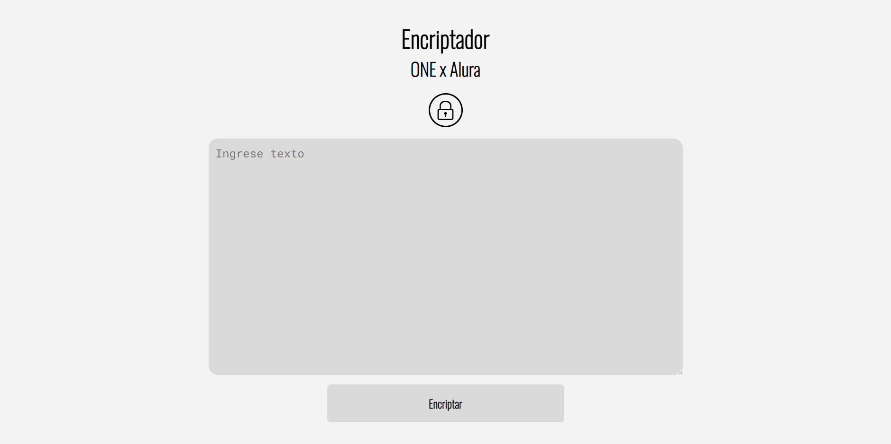
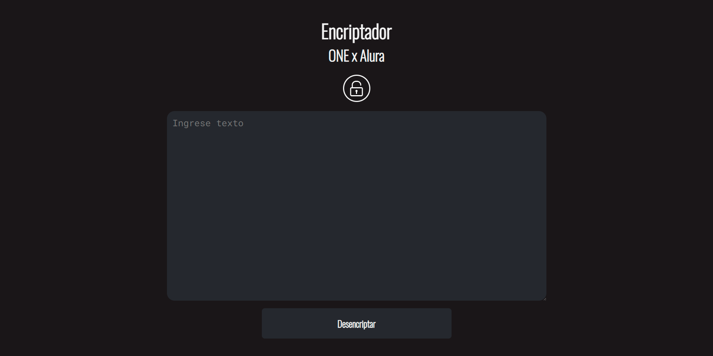

# Encriptador - Desencriptador

La lógica de programación es clave para resolver problemas complejos. Crear un encriptador de texto aplica conocimientos teóricos en un contexto práctico, mejorando habilidades en manipulación de datos y algoritmos, fomentando creatividad e innovación. Este proyecto prepara para futuros desafíos y resalta la importancia de la lógica en el desarrollo de software.

# Modo de Encriptacion

# Modo de Desencriptacion

